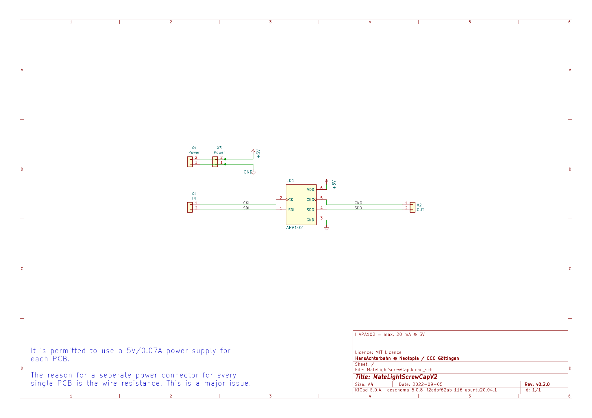
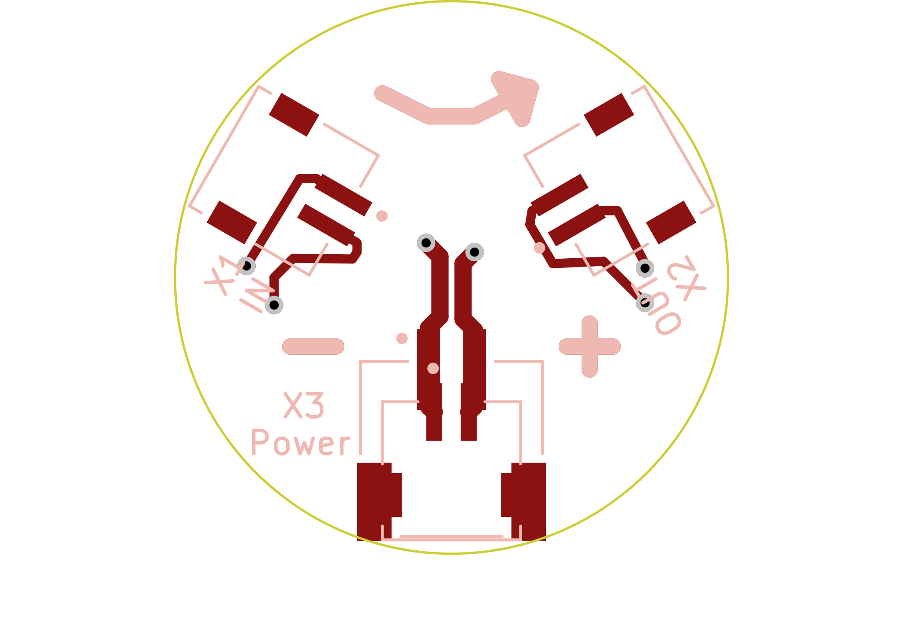
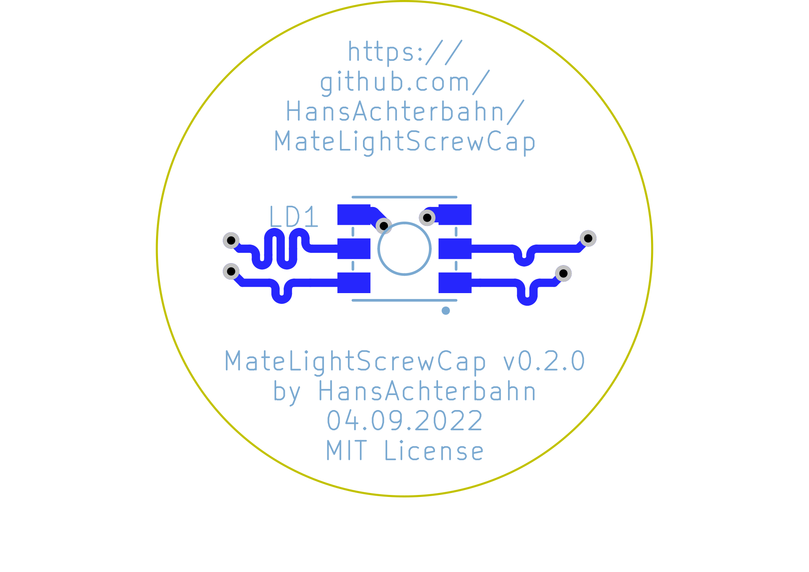

# PCB

Board size: 12.0x0.0 mm (0.47x0.0 inches)

- This is the size of the rectangle that contains the board
- Thickness: 1.6 mm (63 mils)
- Material: FR4
- Finish: HAL
- Layers: 2
- Copper thickness: 35 µm

Solder mask: TOP / BOTTOM

- Color: Green

Silk screen: TOP / BOTTOM

- Color: White

# Important sizes

Clearance: 0.2 mm (8 mils)

Track width: 0.4 mm (16 mils)

- By design rules: 0.2 mm (8 mils)

Drill: 0.5 mm (20 mils)

- Vias: 0.5 mm (20 mils) [Design: 0.4 mm (16 mils)]
- Pads: N/A mm (N/A mils)
- The above values are real drill sizes, they add 0.1 mm (4 mils) to plated holes (PTH)

Via: 0.8/0.4 mm (31/16 mils)

- By design rules: 0.4/0.3 mm (16/12 mils)
- Micro via: no [0.2/0.1 mm (8/4 mils)]
- Burried/blind via: no

Outer Annular Ring: 0.15 mm (6 mils)

- By design rules: N/A mm (N/A mils)

Eurocircuits class: 4B

# General stats

Components count: (SMD/THT)

- Top: 0/4 (THT)
- Bottom: 0/1 (THT)

Defined tracks:

Used tracks:

- 0.4 mm (16 mils) (52) defined: no
- 0.75 mm (30 mils) (16) defined: no

Defined vias:

Used vias:

- 0.8/0.4 mm (31/16 mils) (Count: 6, Aspect: 2.0 A) defined: no

Holes (excluding vias):

Oval holes:

Drill tools (including vias and computing adjusts and rounding):

- 0.5 mm (20 mils) (6)

# Schematic

{ width=16.5cm height=11.7cm }

# PCB Layers

{ width=16.5cm height=11.7cm }

{ width=16.5cm height=11.7cm }

